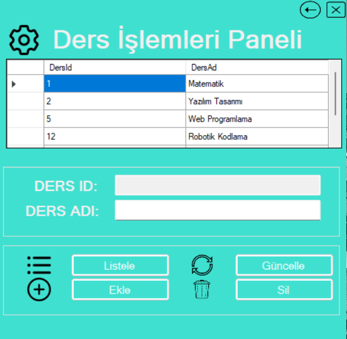

<h1>Öğrenci ve Kulüp Yönetim Sistemi</h1>

Bu uygulama, öğretmen ve öğrencilere yönelik ders, kulüp ve not yönetimini kolaylaştırmak için geliştirilmiş bir masaüstü yazılımıdır. Kullanıcı dostu arayüzü sayesinde ders ve kulüp bilgilerini düzenleyebilir, öğrenciler notlarını görüntüleyebilir ve öğretmenler çeşitli işlemleri gerçekleştirebilir. Uygulama, C# ve Windows Forms ile geliştirilmiştir.

<strong>Not:</strong> Bu proje, <em>Murat Yücedağ</em>'ın Udemy'de yer alan <em>"Uygulama Geliştirerek C# Öğrenin: A'dan Z'ye Eğitim Seti"</em> adlı eğitim kursunda yer alan bir uygulamadır.

<h2>Özellikler</h2>
<ul>
  <li><strong>Ders İşlemleri Paneli:</strong> Dersleri listeleme, ekleme, güncelleme ve silme. Ders adı bilgilerini yönetme.</li>
  <li><strong>Kulüp İşlemleri Paneli:</strong> Kulüpleri listeleme, ekleme, güncelleme ve silme. Kulüp adı bilgilerini düzenleme.</li>
  <li><strong>Giriş Ekranı:</strong> Kullanıcıların öğrenci veya öğretmen olarak seçim yapabileceği basit bir giriş arayüzü. Kullanıcı numarasını girmek için giriş kutusu.</li>
  <li><strong>Öğretmen İşlem Seçim Paneli:</strong> Öğretmenlerin ders ve kulüp yönetimi, öğrenci notlarını düzenleme gibi işlemleri seçebileceği bir ekran.</li>
  <li><strong>Öğrenci Not Görüntüleme Formu:</strong> Öğrencilerin kendi ders notlarını kolayca görebileceği bir form.</li>
</ul>

<h2>Kullanılan Teknolojiler</h2>
<ul>
  <li><strong>Programlama Dili:</strong> C#</li>
  <li><strong>Geliştirme Ortamı:</strong> Visual Studio</li>
  <li><strong>Arayüz:</strong> Windows Forms</li>
</ul>

<h2>Nasıl Kullanılır?</h2>
<ol>
  <li>Uygulamayı indirip çalıştırın.</li>
  <li>Giriş ekranından uygun rolü seçin (Öğrenci veya Öğretmen).</li>
  <li>Öğretmenler için işlem seçme ekranına geçiş yapılır ve ders/kulüp yönetimi veya not düzenleme işlemleri yapılabilir.</li>
  <li>Öğrenciler kendi notlarını görüntüleyebilir veya diğer işlemleri gerçekleştirebilir.</li>
</ol>

<h2>Ekran Görüntüleri</h2>
<h3>Ders İşlemleri Paneli</h3>

)

<h3>Kulüp İşlemleri Paneli</h3>

<h3>Giriş Ekranı</h3>

<h3>Öğretmen İşlem Seçim Paneli</h3>

<h3>Öğrenci Not Görüntüleme Formu</h3>

